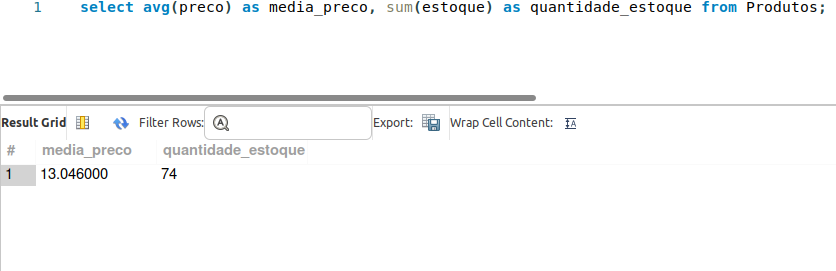

# ac2_Facens
## Atividade individual - Tema: Tabela Produtos (AGRUPAMENTO E AGREGAÇÃO)

### Etapa1

Crie uma tabela Produtos com os seguintes itens id_produto; nome; preço; estoque; perecível; marca; nacionalidade;

Atribua a cada campo seu respectivo tipo;

Os itens: nome; preço; estoque; perecível não poderão receber valores nulos;

O id_produto deve ser utilizado como chave-primaria;

Após a criação insira cinco produtos, todos devem ter seus respectivos campos preenchidos;

Verifique se todos os dados foram inseridos;

Ao término inicie a segunda etapa.
#### Foto da criação da tabela

#### Foto da tabela com todos os 5 dados selecionados

### Etapa2

#### Gere um relatório informando quantos produtos estão cadastrados:

#### Gere um relatório informando o preço médio dos produtos

#### Selecione a média dos preços dos produtos em 2 grupos: perecíveis e não perecíveis

#### Selecione a média dos preços dos produtos agrupados pelo nome do produto

#### Selecione a média dos preços e total em estoque dos produtos

#### Selecione o nome, marca e quantidade em estoque do produto mais caro

#### Selecione os produtos com preço acima da média

#### Selecione a quantidade de produtos de cada nacionalidade

### Etapa 3

Execute toda a atividade no WorkBench da Oracle;

Comente o código esclarecendo o que está sendo feito no bloco de código;

Crie um repositório remoto (GITHUB);

Envie somente o script SQL para o repositório;

Crie o ReadMe com base no modelo disponibilizado em aula;

Tire um print da tela do WorkBench e insira no ReadMe;

Envie na atividade somente o link do repositório criado.

#### Código da tarefa documentado: 

